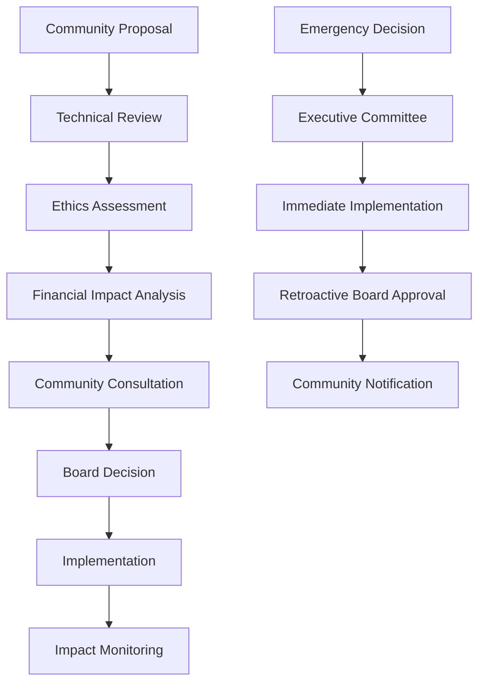

# ElderCare Connect - Community Ownership & Sustainability Strategy

## Overview

The long-term success of ElderCare Connect depends on transitioning from external funding to community ownership and self-sustaining operations. This strategy outlines how to build local capacity, ensure financial viability, and maintain community control over the platform.

## Community Ownership Framework

### 1. Cooperative Governance Model

#### Community Cooperative Structure
```yaml
governance_structure:
  community_assembly:
    composition: "All registered seniors, caregivers, and community members"
    responsibilities: ["Major policy decisions", "Board election", "Constitutional changes"]
    meeting_frequency: "Annual assembly + quarterly updates"
    
  board_of_directors:
    composition:
      - seniors_representatives: 3
      - family_caregivers: 2
      - professional_caregivers: 2
      - ngo_representatives: 2
      - healthcare_providers: 2
      - technical_experts: 2
      - community_volunteers: 2
    term_length: "3 years, staggered terms"
    responsibilities: ["Strategic oversight", "Budget approval", "Policy implementation"]
    
  executive_committee:
    composition: "5 board members + community manager"
    responsibilities: ["Day-to-day operations", "Emergency decisions", "Vendor management"]
    meeting_frequency: "Monthly"
    
  technical_advisory_board:
    composition: "Local developers + academic partners + external experts"
    responsibilities: ["Technical roadmap", "Security oversight", "Innovation guidance"]
```

#### Decision-Making Process


### 2. Local Capacity Building

#### Technical Skills Development
```yaml
capacity_building_program:
  phase_1_training:
    target_audience: "Local IT professionals and students"
    duration: "6 months"
    curriculum:
      - healthcare_informatics: "40 hours"
      - privacy_and_security: "32 hours"
      - mobile_app_development: "60 hours"
      - iot_sensor_management: "40 hours"
      - database_administration: "48 hours"
      - community_engagement: "24 hours"
    
  phase_2_specialization:
    system_administrators: "Advanced infrastructure management"
    developers: "Feature development and customization"
    data_analysts: "Health analytics and reporting"
    community_liaisons: "User support and training"
    
  phase_3_leadership:
    technical_leads: "Architecture and project management"
    community_managers: "Stakeholder coordination"
    trainers: "Knowledge transfer to new communities"
```

#### Community Ambassador Program
```typescript
interface CommunityAmbassador {
  role: 'Senior Tech Helper' | 'Family Liaison' | 'Healthcare Bridge' | 'Youth Volunteer';
  responsibilities: string[];
  training: TrainingModule[];
  support: SupportResource[];
  recognition: RecognitionProgram;
}

const ambassadorProgram: CommunityAmbassador[] = [
  {
    role: 'Senior Tech Helper',
    responsibilities: [
      'Peer-to-peer technology support',
      'Device setup and troubleshooting',
      'Privacy settings guidance',
      'Fear and anxiety reduction around technology'
    ],
    training: ['Digital literacy', 'Patience and empathy', 'Basic troubleshooting'],
    support: ['Regular check-ins', 'Advanced technical backup', 'Continuing education'],
    recognition: ['Community certificates', 'Annual appreciation events', 'Mentorship opportunities']
  },
  {
    role: 'Family Liaison',
    responsibilities: [
      'Onboard new families',
      'Facilitate family-senior communication',
      'Coordinate care team meetings',
      'Cultural sensitivity guidance'
    ],
    training: ['Family dynamics', 'Conflict resolution', 'Cultural competency'],
    support: ['Monthly training sessions', 'Professional development', 'Peer support groups'],
    recognition: ['Community leadership roles', 'Conference speaking opportunities']
  }
];
```

## Financial Sustainability Model

### 1. Revenue Diversification Strategy

#### Tiered Service Model
```yaml
service_tiers:
  community_basic:
    price: "Free"
    target: "Individual seniors and families"
    features:
      - basic_health_monitoring
      - emergency_alerts
      - family_caregiver_access
      - community_events
    limitations:
      - data_retention: "2 years"
      - support: "Community-based"
      - customization: "Limited"
  
  organization_standard:
    price: "$5-50/month per senior (sliding scale)"
    target: "NGOs, small healthcare providers"
    features:
      - all_basic_features
      - advanced_analytics
      - care_coordination_tools
      - professional_caregiver_management
      - training_resources
    benefits:
      - priority_support
      - custom_reporting
      - integration_assistance
  
  enterprise_premium:
    price: "$100-500/month per senior"
    target: "Large healthcare systems, municipalities"
    features:
      - all_standard_features
      - population_health_analytics
      - policy_planning_tools
      - api_access
      - custom_development
    benefits:
      - dedicated_support_team
      - sla_guarantees
      - compliance_assistance
      - custom_integrations
```

#### Social Enterprise Revenue Streams
```yaml
revenue_streams:
  service_subscriptions: "40% of revenue"
  training_and_consulting: "25% of revenue"
  hardware_partnerships: "20% of revenue"
  research_collaborations: "10% of revenue"
  grants_and_donations: "5% of revenue"

specific_offerings:
  training_services:
    community_workshops: "$500-2000 per workshop"
    professional_certification: "$200-500 per person"
    train_the_trainer: "$5000-15000 per program"
    
  consulting_services:
    implementation_support: "$10000-50000 per deployment"
    policy_development: "$5000-25000 per engagement"
    evaluation_and_assessment: "$15000-75000 per study"
    
  hardware_partnerships:
    device_sales: "10-15% commission"
    bulk_purchasing: "5-10% discount facilitation"
    maintenance_contracts: "$50-200 per device per year"
```

### 2. Cost Optimization Framework

#### Efficient Operations Model
```yaml
cost_structure:
  infrastructure: "30%"
  personnel: "45%"
  community_programs: "15%"
  research_and_development: "8%"
  administrative: "2%"

optimization_strategies:
  infrastructure:
    cloud_efficiency: "Right-sizing and auto-scaling"
    edge_computing: "Reduce bandwidth and storage costs"
    open_source: "Minimize licensing fees"
    
  personnel:
    remote_work: "Reduce office overhead"
    skill_sharing: "Cross-functional team members"
    volunteer_integration: "Community volunteers for specific tasks"
    
  technology:
    automation: "Reduce manual administrative tasks"
    self_service: "Empower users to solve own problems"
    preventive_maintenance: "Reduce emergency support costs"
```

### 3. Community Investment Strategy

#### Local Economic Impact
```yaml
community_investment:
  job_creation:
    technical_positions: "5-10 local developers and administrators"
    community_roles: "15-25 support and outreach positions"
    training_positions: "3-5 dedicated trainers"
    
  local_procurement:
    hardware_sourcing: "Partner with local electronics vendors"
    service_providers: "Legal, accounting, marketing from local firms"
    facilities: "Community centers and co-working spaces"
    
  skill_development:
    digital_literacy: "Community-wide technology training"
    entrepreneurship: "Support health-tech startups"
    research_skills: "Academic collaboration opportunities"
```

## Knowledge Transfer & Documentation

### 1. Comprehensive Documentation System

#### Multi-Level Documentation
```yaml
documentation_framework:
  user_documentation:
    target: "Seniors, caregivers, families"
    formats: ["Large print guides", "Video tutorials", "Audio instructions"]
    languages: ["Local primary language", "Regional dialects"]
    update_frequency: "With each release"
    
  administrator_documentation:
    target: "NGO staff, municipal workers"
    content: ["System configuration", "User management", "Reporting tools"]
    training: "Hands-on workshops and certification"
    
  technical_documentation:
    target: "Developers, system administrators"
    content: ["API documentation", "Database schemas", "Security protocols"]
    maintenance: "Community-driven with version control"
    
  policy_documentation:
    target: "Decision makers, compliance officers"
    content: ["Privacy policies", "Ethical guidelines", "Governance procedures"]
    review: "Annual updates with community input"
```

#### Knowledge Management System
```typescript
interface KnowledgeBase {
  categories: {
    userGuides: {
      seniorCitizens: Tutorial[];
      familyCaregivers: Tutorial[];
      professionalCaregivers: Tutorial[];
      volunteers: Tutorial[];
    };
    technicalDocs: {
      installation: Documentation[];
      configuration: Documentation[];
      troubleshooting: Documentation[];
      development: Documentation[];
    };
    governance: {
      policies: Policy[];
      procedures: Procedure[];
      decisionHistory: Decision[];
      meetingMinutes: Meeting[];
    };
  };
  
  accessibility: {
    multiLanguage: boolean;
    audioDescriptions: boolean;
    largePrint: boolean;
    easyRead: boolean;
    signLanguage: boolean;
  };
  
  maintenance: {
    reviewSchedule: string;
    updateProcess: string;
    versionControl: string;
    communityContribution: boolean;
  };
}
```

### 2. Training & Certification Programs

#### Comprehensive Training Framework
```yaml
training_programs:
  end_user_training:
    seniors_and_families:
      basic_usage: "4-hour workshop"
      privacy_settings: "2-hour session"
      troubleshooting: "2-hour session"
      advanced_features: "4-hour workshop"
      
    caregivers_and_volunteers:
      system_overview: "6-hour training"
      care_coordination: "4-hour workshop"
      emergency_response: "3-hour certification"
      data_interpretation: "4-hour workshop"
      
  administrator_training:
    ngo_staff:
      user_management: "8-hour course"
      reporting_and_analytics: "6-hour workshop"
      community_engagement: "4-hour training"
      
    municipal_staff:
      population_analytics: "8-hour course"
      policy_integration: "6-hour workshop"
      resource_planning: "4-hour training"
      
  technical_training:
    system_administrators:
      installation_and_setup: "16-hour course"
      security_management: "12-hour certification"
      performance_optimization: "8-hour workshop"
      
    developers:
      codebase_overview: "20-hour course"
      feature_development: "16-hour workshop"
      testing_and_quality: "12-hour training"
```

## Technology Transfer Strategy

### 1. Open Source Community Building

#### Development Community Structure
```yaml
open_source_governance:
  core_maintainers:
    composition: "5-7 experienced developers"
    responsibilities: ["Code review", "Release management", "Architecture decisions"]
    selection: "Community nomination and voting"
    
  contributors:
    levels: ["Occasional", "Regular", "Core"]
    progression: "Based on code contributions and community involvement"
    recognition: "Contributor badges and annual recognition"
    
  special_interest_groups:
    accessibility: "Focus on inclusive design"
    security: "Privacy and security enhancements"
    localization: "Multi-language and cultural adaptation"
    mobile: "Mobile app development and optimization"
    
  decision_making:
    consensus: "Preferred approach for most decisions"
    voting: "For contentious issues with clear procedures"
    benevolent_dictator: "Final decision authority for deadlocks"
```

#### Code Quality & Sustainability
```typescript
interface OpenSourceStandards {
  codeQuality: {
    testCoverage: number; // Minimum 80%
    documentationCoverage: number; // Minimum 90%
    codeReview: boolean; // Required for all changes
    continuousIntegration: boolean;
  };
  
  community: {
    contributorGuidelines: boolean;
    codeOfConduct: boolean;
    issueTemplates: boolean;
    pullRequestTemplates: boolean;
  };
  
  sustainability: {
    dependencyManagement: string;
    securityUpdates: string;
    longTermSupport: string;
    migrationSupport: string;
  };
}
```

### 2. Replication Framework

#### Deployment Toolkit
```yaml
replication_package:
  technical_components:
    infrastructure_templates: "Docker containers and Kubernetes configs"
    database_schemas: "Complete setup scripts with sample data"
    configuration_tools: "Web-based setup wizard"
    monitoring_dashboards: "Pre-configured health and performance monitoring"
    
  community_tools:
    stakeholder_mapping: "Templates for identifying key community partners"
    needs_assessment: "Survey tools and interview guides"
    pilot_planning: "Step-by-step implementation guide"
    
  training_materials:
    facilitator_guides: "Train-the-trainer resources"
    workshop_curricula: "Customizable for local context"
    assessment_tools: "Competency testing and certification"
    
  governance_templates:
    policy_frameworks: "Adaptable privacy and ethical policies"
    organizational_structures: "Legal and governance templates"
    financial_planning: "Budget templates and sustainability models"
```

#### Implementation Support Network
```yaml
support_network:
  regional_hubs:
    locations: "Major urban centers in each region"
    staffing: "1-2 full-time implementation specialists"
    services: ["On-site training", "Technical support", "Policy guidance"]
    
  peer_learning:
    community_exchanges: "Sister city partnerships for knowledge sharing"
    annual_conferences: "Best practices and innovation sharing"
    online_forums: "Continuous peer support and problem-solving"
    
  expert_network:
    technical_mentors: "Volunteer experts for complex technical issues"
    governance_advisors: "Experienced community organizers and policy experts"
    research_partners: "Academic collaborators for impact assessment"
```

## Impact Measurement & Accountability

### 1. Community-Defined Success Metrics

#### Participatory Evaluation Framework
```yaml
success_indicators:
  health_outcomes:
    emergency_response_time: "Community-defined target (e.g., <5 minutes)"
    health_incident_reduction: "Baseline measurement + improvement goals"
    medication_adherence: "Before/after comparison"
    quality_of_life_scores: "Standardized assessment tools"
    
  social_outcomes:
    social_isolation_reduction: "Community engagement metrics"
    family_caregiver_stress: "Standardized stress assessments"
    community_cohesion: "Social capital measurement"
    volunteer_participation: "Active volunteer hours and retention"
    
  system_outcomes:
    user_adoption: "Active user percentages by demographic"
    system_reliability: "Uptime and performance metrics"
    cost_effectiveness: "Cost per user per health outcome"
    sustainability_metrics: "Revenue diversification and community ownership"
```

#### Continuous Feedback Loop
```typescript
interface FeedbackSystem {
  dataCollection: {
    quantitativeMetrics: HealthMetric[];
    qualitativeStories: UserStory[];
    satisfactionSurveys: Survey[];
    focusGroups: FocusGroup[];
  };
  
  analysis: {
    trendAnalysis: boolean;
    outcomeAttribution: boolean;
    costBenefitAnalysis: boolean;
    equityAssessment: boolean;
  };
  
  reporting: {
    communityDashboards: boolean;
    academicPublications: boolean;
    policybriefs: boolean;
    mediaUpdates: boolean;
  };
  
  actionPlanning: {
    improvementPlans: boolean;
    resourceReallocation: boolean;
    policyAdjustments: boolean;
    systemEnhancements: boolean;
  };
}
```

### 2. Long-term Viability Assessment

#### Sustainability Scorecard
```yaml
sustainability_scorecard:
  financial_health: 
    weight: 25
    indicators:
      - revenue_diversification
      - cost_management
      - reserve_funds
      - community_investment
      
  community_ownership:
    weight: 30
    indicators:
      - governance_participation
      - local_leadership
      - skill_development
      - decision_making_autonomy
      
  technical_sustainability:
    weight: 20
    indicators:
      - code_maintainability
      - security_updates
      - performance_optimization
      - innovation_capacity
      
  social_impact:
    weight: 25
    indicators:
      - health_outcomes
      - social_cohesion
      - equity_improvements
      - user_satisfaction

scoring:
  excellent: "90-100 points"
  good: "75-89 points"
  needs_improvement: "60-74 points"
  at_risk: "<60 points"
```

This comprehensive sustainability strategy ensures that ElderCare Connect transitions successfully from an externally-funded project to a community-owned and operated platform that continues to serve seniors with dignity, respect, and effectiveness for decades to come.